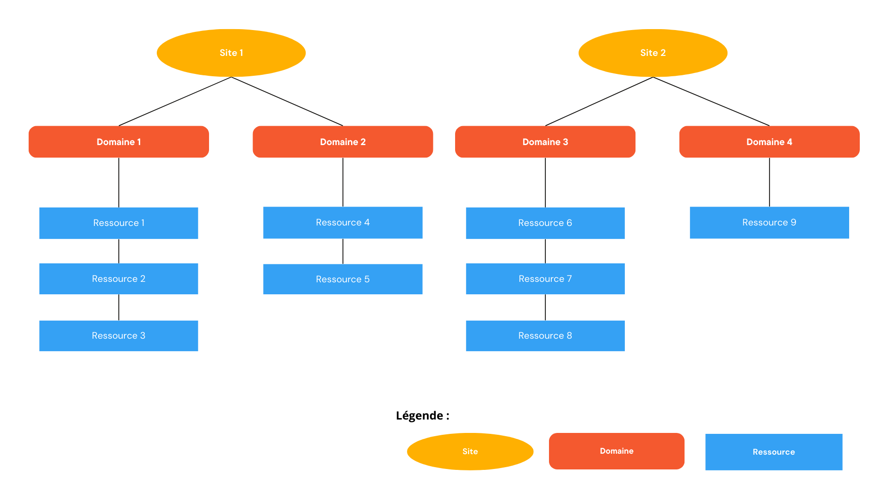

! Requiert l'activation du module multi-site ( Configuration générale / Modules )

Vous pouvez créer une hiérarchie de 3 niveaux : Sites => Domaines => Ressources

Cette fonctionnalité est souvent activée en cas de grand nombre de ressources et/ou répartie sur plusieurs lieux.

Vous créer un nombre illimité de sites. Chaque site doit avoir au minimum un code et un nom. Le code n'a pas d'importance mais doit-être unique pour chaque site.

Vous pouvez aussi renseigner des informations de localisation du site (adresse, téléphone...)